# Fanta Tic-Tac-Toe 
Lastest Version(mcts tree search + neural network)
---------------------
[tictactoe with mcts](https://github.com/yangx18/Fanta-Tic-Tac-Toe/blob/main/main/tictactoe_nn/mcts.py "Fanta Tic-Tac-Toe")

An advanced, 3x3x3x3 version of traditional Tic-Tac-Toe.

[fantatictactoe.py](https://github.com/yangx18/Fanta-Tic-Tac-Toe/blob/main/main/fantatictactoe.py "Fanta Tic-Tac-Toe")

Below test.py is  for running numbers automatic games between tree-base ai and baseline ai.

[test.py](https://github.com/yangx18/Fanta-Tic-Tac-Toe/blob/main/main/test.py "Run numbers automatic games between tree-base ai and baseline ai")


## Table of contents
* [General info](#general_info)
* [Step by step Running Example](#Step_by_step_Running_Example)
* [Screenshots](#screenshots)
* [Technologies](#technologies)
* [Setup](#setup)
* [Features](#features)
* [Status](#status)
* [Experimental Results](#experimental_results)
* [Sources](#sources)
* [Contact](#contact)
* [License](#license)

## General Info
In this game, each single grid in a 3x3 grid represents a 3x3 grid in the whole 9x9 board. For example, once the first player locates the mark on (0, 0)(1, 1), which is the middle grid of the top-left corner 3x3 grid. Then the next player has to follow the rules - locate the next mark on the middle 3x3 grid, and mark (1, 1)(0, 2). And the first player has to locate the mark in the top-right grid. And so on. And there are some obstacles named ***"P"*** which will be placed at the beginning(nobody can place at ***"P"***) .If one grid has a horizontal, vertical, or diagonal row then this grid has been completed. The player has to mark other grids. Once who has dominated 3 grids is the winner. Also, we implemented two AI in this game. One is baseline AI, which chooses actions uniformly at random. The other one is tree-based AI, which is implemented minimax algorithm with alpha-beta pruning. 

Four modes of the game:
1. Player VS Tree-based AI
2. Player VS Baseline AI
3. Tree-based AI VS Tree-based AI
4. Tree-based AI VS Baseline AI

The following image shows the sample of the game rule

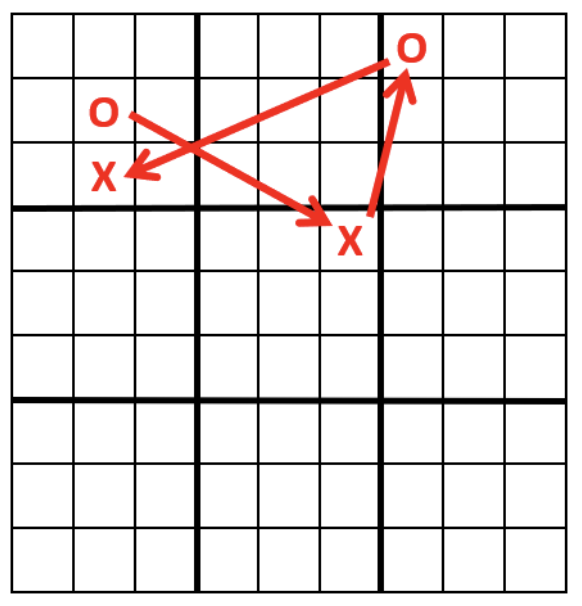

## Step by step Running Example
* Anaconda python [fantatictactoe.py](https://github.com/yangx18/Fanta-Tic-Tac-Toe/blob/main/main/fantatictactoe.py "Fanta Tic-Tac-Toe")
* Decide instance size(number of obstacle)
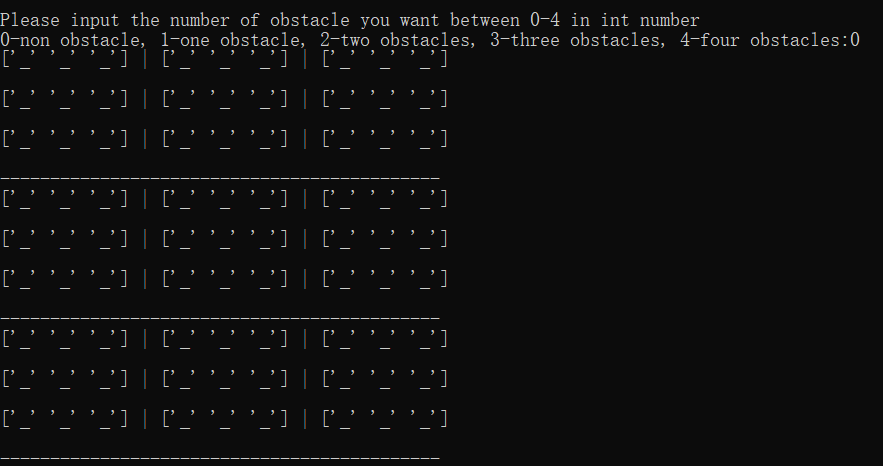 
or
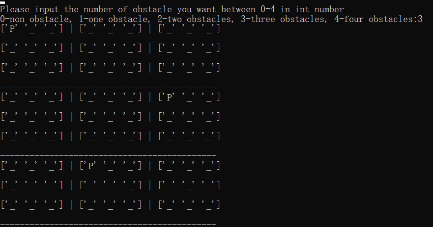
* Choose different game mode:
(Please read the rule first, and place your 'X' in corresponding grid.) 
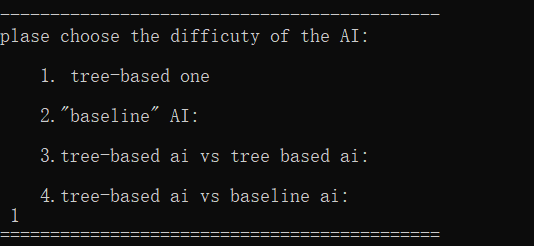
- 1.player with tree-based ai

- 2.player with baseline ai
- 3.tree-based ai with tree-based ai
- 4.tree-based ai vs tree-based ai
      
## Screenshots
The following images show mode 3 and mode 4 test results 

* Size: 2 obstacles
* Mode: 3
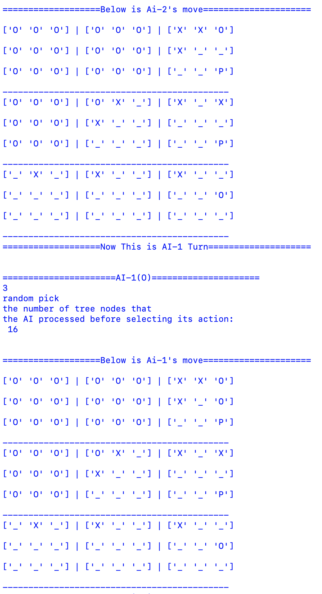

* Size: 3 obstacles
* Mode: 4
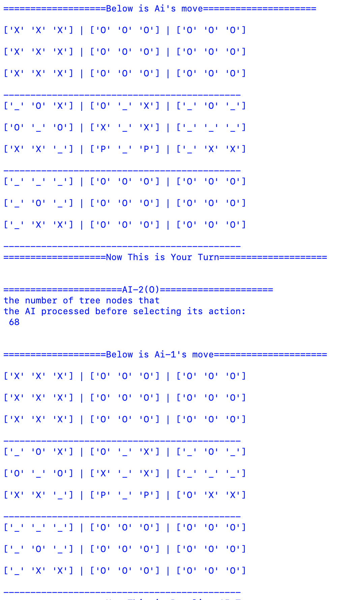

## Technologies
Project is created with:

Programming language

* Python 3

Libraries

* Numpy
* TensorFlow
* Scipy
* Pandas

Algorithm

* Minimax Algorithm
* Alpha-Beta Pruning

## Setup
1. Install anaconda on your computer
   
   * Windows: Follow <https://docs.anaconda.com/anaconda/install/windows/>
   * Mac: Follow <https://docs.anaconda.com/anaconda/install/mac-os/>
   * Linux: Follow <https://docs.anaconda.com/anaconda/install/linux/>

2. Make sure you have installed python in your computer, here is the link: <https://www.python.org/>, then install it locally using:
   
   ```
   conda install numpy
   ```
   or
   ```
   pip install numpy
   ```
 
3. Download and run this .py file on your anaconda
   
   [fantatictactoe.py](https://github.com/yangx18/Fanta-Tic-Tac-Toe/blob/main/fantatictactoe.py "Fanta Tic-Tac-Toe")

## Features
Main concept of this game is followed by ***minimax algorithm***. Minimax is a kind of backtracking algorithm that is used in decision making and game theory to find the optimal move for a player, assuming that your opponent also plays optimally.
And for improve the efficency of game algorithm, we uesed ***Alpha–beta pruning strategy***, which is a search algorithm that seeks to decrease the number of nodes that are evaluated by the minimax algorithm in its search tree.

- Minimax Algorithm
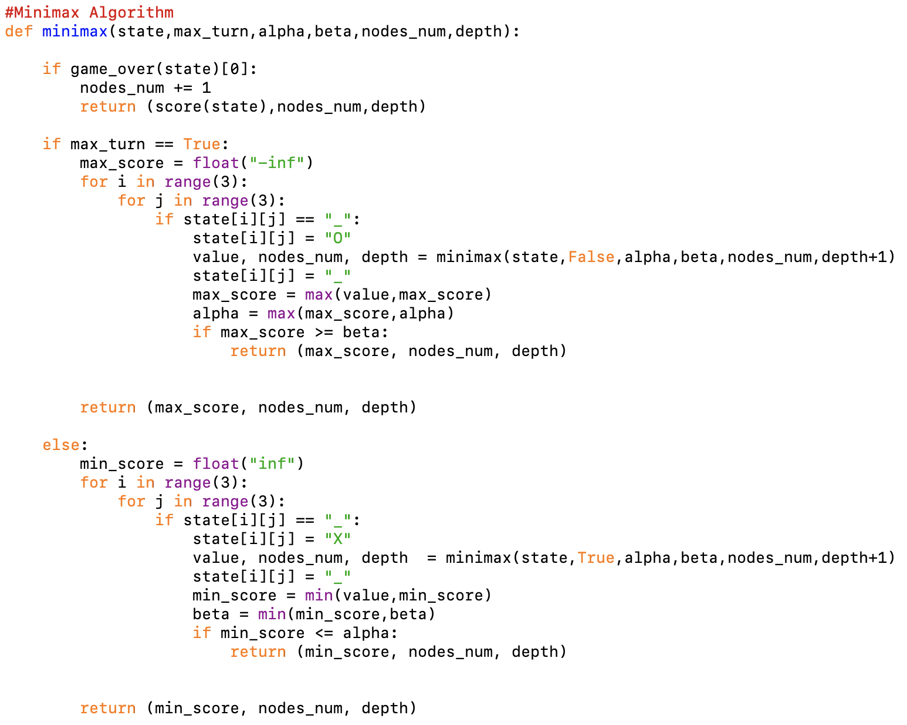
- Alpha–beta Pruning Strategy
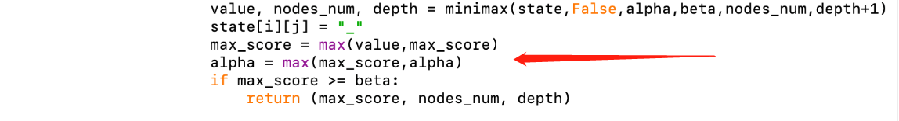
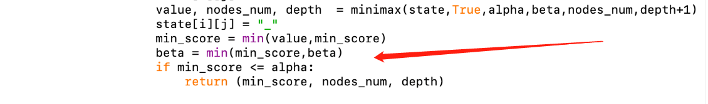


## Status
Project is in progress, and there are still some problem but we will fix them in the later semester.(descriptions in () are possible solutions)

* AI is better than the last one but not performed well as we expected
* Trying to strengthen the algorithm to increase the winning rate of the tree-based AI

## Experimental Results
In this experiment we change the number of obstacles to modify the size of the board. In each size, we simulate 100 games to the following results. 

* Mode: 4

* Size: 0 obstacles
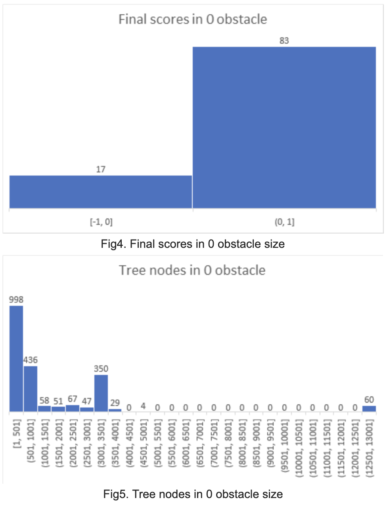

* Size: 1 obstacles
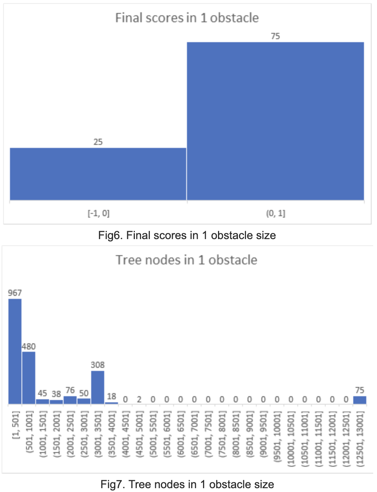

* Size: 2 obstacles
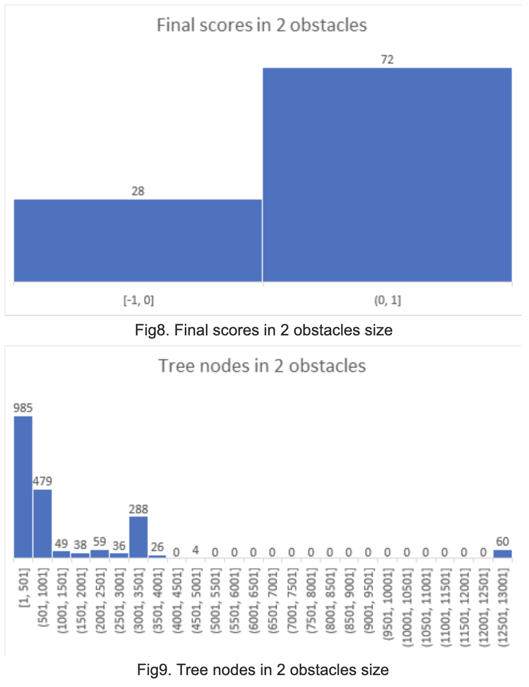

* Size: 3 obstacles
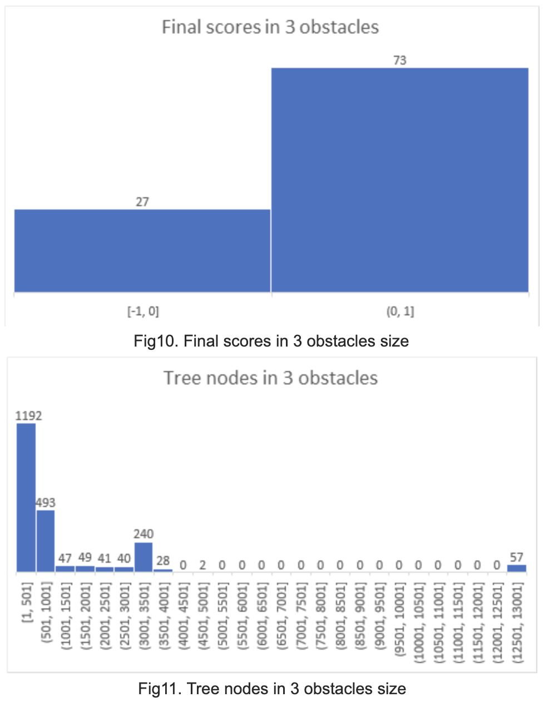

* Size: 4 obstacles
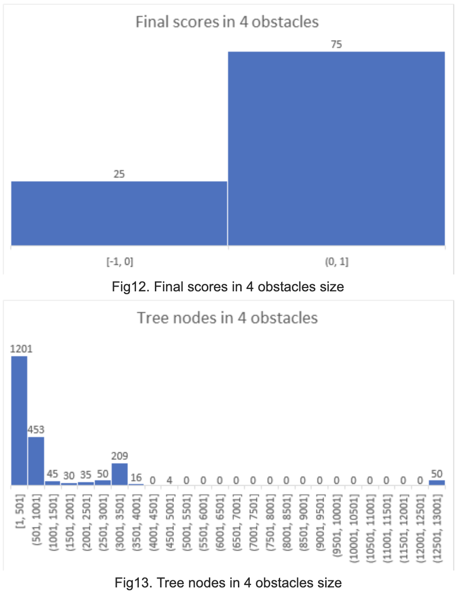

## Sources
This project is inspired by 

* The Coding Train. (2019, December 11). Coding Challenge 154: Tic Tac Toe AI with Minimax Algorithm. Retrieved October 28, 2020, from           https://www.youtube.com/watch?v=trKjYdBASyQ&ab_channel=TheCodingTrain
*  Minimax Algorithm in Game Theory: Set 1 (Introduction). (2019, May 28). Retrieved October 28, 2020, from https://www.geeksforgeeks.org/minimax-algorithm-in-game-theory-set-1-introduction/
*  Minimax Algorithm in Game Theory: Set 4 (Alpha-Beta Pruning). (2019, December 05). Retrieved October 28, 2020, from https://www.geeksforgeeks.org/minimax-algorithm-in-game-theory-set-4-alpha-beta-pruning/
* 柯伊伯带的咸鱼. (2018, January 31). 让井字棋变得不一样--战略井字棋！. Retrieved October 28, 2020, from https://www.bilibili.com/read/cv187749/

## Contact
If you have any questions, feel free to contact us with the following emails:

* <yxiao09@syr.edu>
* <yzhou01@syr.edu>
* <leonlovesparis@gmail.com>

## License:
MIT License

Copyright (c) [2020] [Xiao Yang, Zhou Yixin, Li Ang]

Permission is hereby granted, free of charge, to any person obtaining a copy
of this software and associated documentation files (the "Software"), to deal
in the Software without restriction, including without limitation the rights
to use, copy, modify, merge, publish, distribute, sublicense, and/or sell
copies of the Software, and to permit persons to whom the Software is
furnished to do so, subject to the following conditions:

The above copyright notice and this permission notice shall be included in all
copies or substantial portions of the Software.

THE SOFTWARE IS PROVIDED "AS IS", WITHOUT WARRANTY OF ANY KIND, EXPRESS OR
IMPLIED, INCLUDING BUT NOT LIMITED TO THE WARRANTIES OF MERCHANTABILITY,
FITNESS FOR A PARTICULAR PURPOSE AND NONINFRINGEMENT. IN NO EVENT SHALL THE
AUTHORS OR COPYRIGHT HOLDERS BE LIABLE FOR ANY CLAIM, DAMAGES OR OTHER
LIABILITY, WHETHER IN AN ACTION OF CONTRACT, TORT OR OTHERWISE, ARISING FROM,
OUT OF OR IN CONNECTION WITH THE SOFTWARE OR THE USE OR OTHER DEALINGS IN THE
SOFTWARE.
